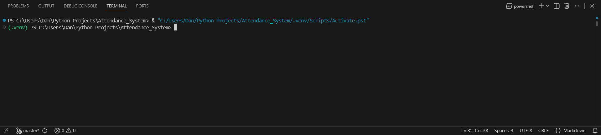
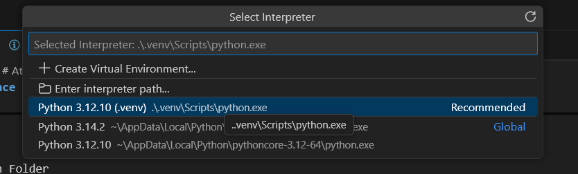

# Attendance System
A QR-based attendance system that tracks student logs sent to Google Sheets using Python libraries and QR scanner device.

## Setup
1. Download and install **Python and **Git:
    - [Python 3.12.10](https://www.python.org/ftp/python/3.12.10/python-3.12.10-amd64.exe)
    - [Git](https://github.com/git-for-windows/git/releases/download/v2.52.0.windows.1/Git-2.52.0-64-bit.exe) or watch this video [How to Install Git & Use Git in Visual Studio Code](https://youtu.be/3Tsaxxv9sls?t=43)

2. Create a project folder
    > project_name
    - For example:
    > C:\Users\Dan\Python_Projects

    or the directory of your project folder.

3. Open Windows Terminal and copy and paste this using
    - via PowerShell or Command Prompt:
    ```cmd
    git clone https://github.com/danclangcoder/attendance-system.git
    ```

4. Open Visual Studio Code and select
    > File

    and

    > Open Folder

    Then, select your **attendance-system folder.

5. Open Terminal and create a virtual environment and activate:
    ```powershell
    python3.12 -m venv .venv
    .venv/Scripts/Activate.ps1
    ```

6. Once activated, your terminal will look like this:
    

7. Next, select the correct Python interpreter (.venv) by using VS Code commands:
    - Ctrl + Shift + P
    Then, type interpreter and select

    > Python: Select Interpreter

    Then, click the Python 3.12.10 (.venv) interpreter.
    

8. Install the packages listed in requirements.txt file by copy and paste on your VS Code Terminal:
    ```powershell
    pip install -r requirements.txt
    ```

## When updating code, simply run these commands on your VS Code Terminal
**For example when updating a single file:
```powershell
git init
git pull origin master
git add qr_scanner.py
git commit -m "Added new function"
git push origin master
```